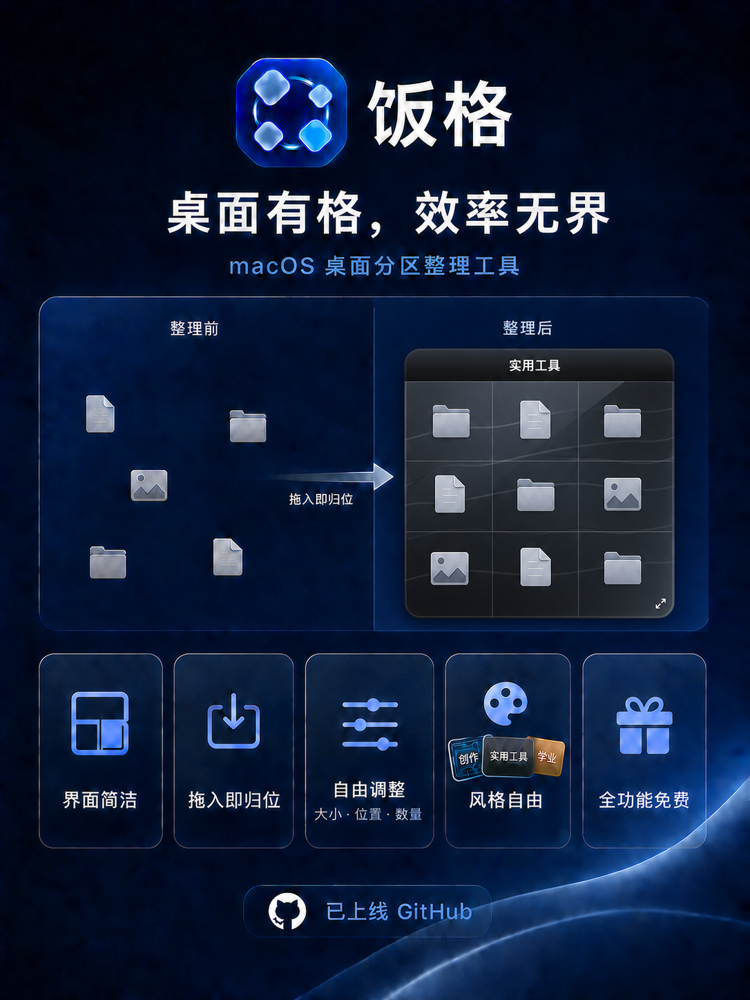

# 饭格 Fange

<p align="center">
  
</p>

<p align="center"><strong>桌面有格，效率无界。</strong></p>

<p align="center">原生 macOS 桌面分区整理工具 · 全功能免费 · Apache-2.0 开源</p>

饭格在 Finder 桌面图标下方创建可自由定制的整理分区。文件仍然由 Finder 管理，照常双击、拖动和打开；饭格只负责让图标归位，让桌面更清楚、更顺手。

> 当前版本：`0.1.0 Beta 2`。全部功能免费，无广告、无账号、无订阅；源代码允许个人和企业使用、修改与商用。

<p align="center">
  
</p>

## 下载

前往 [GitHub Releases](https://github.com/Myf-ricey/Fange-macOS/releases/tag/v0.1.0-beta.2) 下载，或使用[直接下载链接](https://github.com/Myf-ricey/Fange-macOS/releases/download/v0.1.0-beta.2/Fange-v0.1.0-beta.2-macOS-universal.zip)：

```text
Fange-v0.1.0-beta.2-macOS-universal.zip
```

支持 Apple Silicon 与 Intel Mac，系统要求 macOS 13 Ventura 或更高版本。

## 核心特色

### 界面简洁

分区位于 Finder 图标下方，不替换图标、不创建隐藏文件夹，也不改变熟悉的桌面操作方式。

### 风格自由

支持 mac 原生、叠层玻璃、胶片、金属、陶瓷、织物、纸张、全息、液态铬、光刻电路等多种材质，还可以调整颜色、渐变、透明度、边框、标题和间距。

三个代表性搭配：

- **AI**：光刻电路 + 石墨渐层，冷色科技感。
- **实用工具**：叠层玻璃 + 墨黑标签，简洁沉稳。
- **学业**：云龙纤维纸 + 纸签标签，温和清晰。

### 操作便捷

- 把桌面图标拖入分区，松手后自动吸附到最近空位。
- 图标与分区保持绑定，移动或缩放分区后仍会整齐归位。
- 分区大小、位置、数量、行列和图标间距都可自由调整。
- 常驻菜单栏，可选择登录时自动启动。

### 全功能免费

当前公开版本不区分基础版和高级版，没有功能付费墙。

## 安装方法

1. 从 Releases 下载 ZIP 并解压。
2. 把“饭格.app”拖入“应用程序”。
3. 当前 Beta 尚未完成 Apple Developer ID 签名与公证。首次双击时若 macOS 阻止启动，请在尝试启动后前往“系统设置 → 隐私与安全性”，向下滚动到“安全性”，点按饭格旁的“仍要打开”，再确认一次“打开”。系统记住这次选择后，之后即可正常双击启动。不要关闭 Gatekeeper，也不需要运行解除安全限制的命令。
4. 首次整理图标时，macOS 会询问是否允许饭格控制 Finder，请选择允许。

更详细的安装和权限说明见 [安装指南](docs/INSTALL.md)。

## 快速使用

1. 启动饭格，点击菜单栏饭碗图标打开设置。
2. 在普通模式下，把 Finder 桌面图标拖入分区即可吸附。
3. 开启“编辑模式”，可拖动分区或从右下角调整大小。
4. 使用 `+` 新建分区，通过“更多”调整材质、标题、行列和间距。

完整说明见 [使用指南](docs/USER_GUIDE.md)。

## 从源码构建

需要 macOS 13 或更高版本，以及已安装 Swift 编译器的 Xcode Command Line Tools：

```sh
git clone https://github.com/Myf-ricey/Fange-macOS.git
cd Fange-macOS
./test-drag.sh
./test-single-instance.sh
./build.sh
open DesktopRegions.app
```

源码构建版不包含饭格官方 App 图标和图片字标，会使用系统默认图标与文字标题；这不影响功能。官方品牌资源只包含在 GitHub Releases 的官方构建中。

## 隐私

饭格不联网，不收集分析数据，不上传文件。它只在本机读取 Finder 桌面图标的位置和路径，并把分区设置保存在本地。详见 [隐私说明](PRIVACY.md)。

## 开源许可

源码、测试、构建脚本和文本说明采用 [Apache License 2.0](LICENSE)：

- 允许个人与企业使用、修改、商用和再发布；
- 允许把修改后的代码用于闭源商业产品，不强制公开衍生产品源码；
- 再发布时必须保留许可证、版权和 NOTICE，并标明对原文件所作的修改；
- 许可证包含明确的专利授权，但不授予饭格品牌使用权。

“饭格 / Fange”名称、官方图标、字标、海报与宣传图不在 Apache-2.0 授权范围内。分叉版本公开发布前须更换品牌元素，详见 [品牌与视觉资产说明](BRAND_ASSETS.md)。参与开发见 [贡献指南](CONTRIBUTING.md)。

## 反馈

- 使用疑问：查看 [常见问题](docs/FAQ.md)
- Bug 或功能建议：提交 GitHub Issue
- 安全问题：查看 [安全说明](SECURITY.md)
